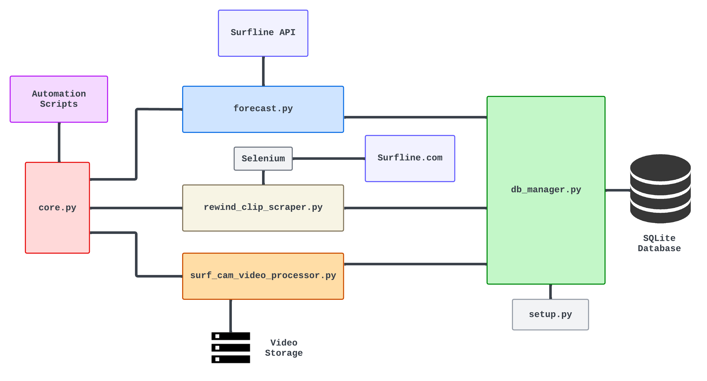
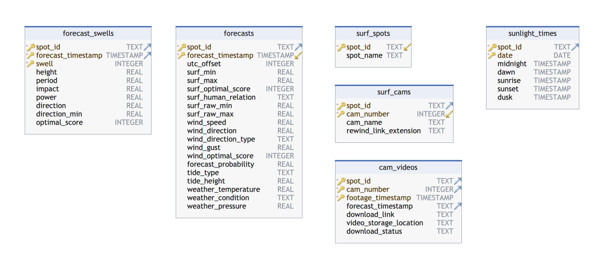

# Surf Forecast and Videos Dataset

This project builds a dataset of archived Surfline forecasts for several surf spots as well as periodic 60s videos of their cams.

This project is complimentary to 

We limit this project to a small number of surf spots and cameras, due to storage and computation constraints. Specifically we will focus on:
- **Jeffreys Bay** (J-Bay), SA.
    - [J-Bay](https://www.surfline.com/surf-cams/jeffreys-bay-j-bay-/5f7ca72ba43acae7a74a4878) - The main camera which views the wave from above.
    - [J-Bay Front](https://www.surfline.com/surf-cams/jeffreys-bay-j-bay-/62daa32b3fd9a5b33b2130ea) - Secondary camera viewing the waves front on.
- **Supertubos**, Peniche, Portugal.
    - [Supertubes](https://www.surfline.com/surf-report/supertubos/5842041f4e65fad6a7708bc3?camId=5834a117e411dc743a5d52ed) - The main camera.
- **Fresh West**, Pembrokeshire, UK.
    - There is no camera for this beach, but the forecast data is still collected as it can be used on its own, and it leaves the flexibility to integrating photos and videos from other sources (such as social media).

## Overview



## Files

- `core.py` is the main script which combines functionalities of all other scripts.
- `setup.py` can be run to set the database up with surf spots and cams. It loads data from `surf_spots_data.json`.
- `forecast.py` is based on the `pysurfline` package and has a `SurflineWrapper` object which can be used to fetch the forecast for a spot and then the `Forecast` object can store forecast object and flatten it ready for a dataframe or database.
- `db_manager.py` has a `DBManager` object which manages creating, reading and writing to/from the database. All interactions with the database are handled through methods of this class.
- `rewind_clip_scraper` uses Selenium to log into Surfline and find the cdn server links to rewind clips of the cams.
- `surf_cam_video_processor.py` is responsible for downloading the surf videos and using `FFMPEG` to cut the videos down to 60s and compress them.
- `run_all.py` and `run_forecasts.py` are scripts for automation which call on the functions in `core.py`.
- `plotting.py` is an incomplete implementation to plot forecast objects.
- `config.json` is a file for storing Surfline login details.
  ```
  {"email": "example@gmailcom", "password": "Password123"}
  ```


## Database Schema



**Videos are stored in `videos/` directory.**

## Requirements

- `FFMPEG` is used for video processing.
- Linux or macOS. Will not work on windows as modifies video creation date with `os.utime()` in `surf_cam_video_processor.py`.
- Required python packages can be found in `requirements.txt`.
